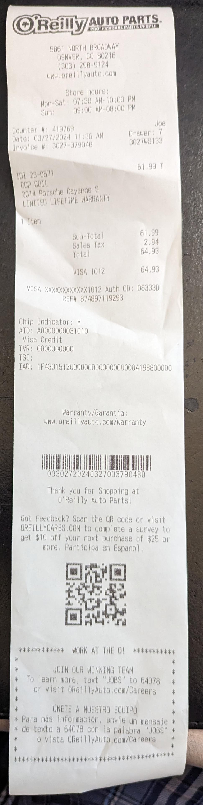

# 2024 Maintenance Record

## March 5
*Milage ~112k*

Got a "reduced engine power" notification on the dash.  Cleared the alarm twice.  Proceeded with trying fuel from not-conoco and putting fresh plugs in the car.

## March 27

Got a P0308 cylinder 8 misfire detected.  Swapped the coil packs from cyl 7 and 8 and read a P0307 which is the same error on cylinder 7.  The issue followed the coil so a single one was replaced as a test. [part link](https://www.oreillyauto.com/detail/c/import-direct-ignition/import-direct-ignition-coil/odi0/230571/v/a/127001/automotive-suv-2014-porsche-cayenne?q=2014+porsche+cayenne+coil&pos=0)

Original on left, Oreilly on right

## May 13

### Fuel Filter and Pump
Reduced engine power light has periodically come on.  Replacing the low pressure pump and fuel filter as a start before moving onto the high pressure pump as a prevenative measure.

part number on outside of part removed: 7P0919679 [receipt](receipts/may_fuel_filter.pdf)  Note: amazon's fitment check and guide was incorrect on this part.  

part 7P0919087 [receipt](receipts/may_fuel_pump.pdf)

notes:
to replace the fuel filter, only the drivers side needs to come out.  the replace the pump, both need to be removed as the fuel cover line routes to the drivers side from the passenger.