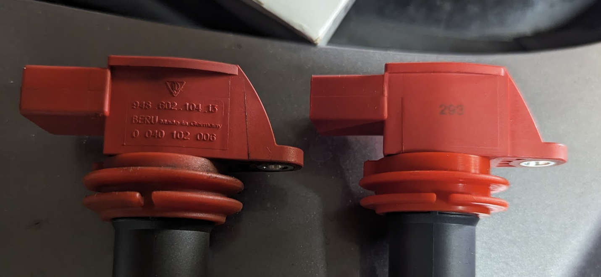

# 2024 Maintenance Record

## March 5
*Milage ~112k*

Got a "reduced engine power" notification on the dash.  Cleared the alarm twice.  Proceeded with trying fuel from not-conoco and putting fresh plugs in the car.

## March 27

Got a P0308 cylinder 8 misfire detected.  Swapped the coil packs from cyl 7 and 8 and read a P0307 which is the same error on cylinder 7.  The issue followed the coil so a single one was replaced as a test. [part link](https://www.oreillyauto.com/detail/c/import-direct-ignition/import-direct-ignition-coil/odi0/230571/v/a/127001/automotive-suv-2014-porsche-cayenne?q=2014+porsche+cayenne+coil&pos=0)

Original on left, Oreilly on right

